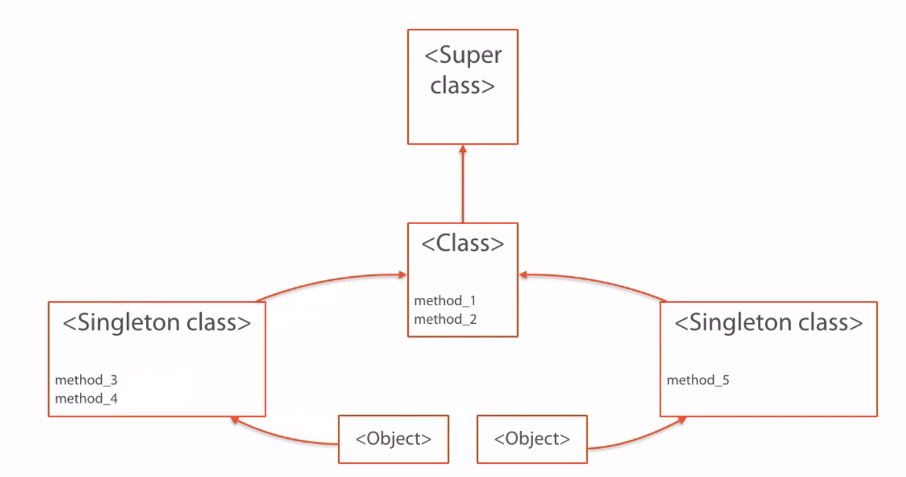

# Ruby beyond the basics
> Notes from [this pluralsight course](https://app.pluralsight.com/library/courses/ruby-beyond-the-basics)

## Ruby is an Object-Oriented Language

OOP is a very common concept that usually isn't well specified. Ruby's object oriented nature is inspired in a language called SmallTalk, designed by Alan Kay, the guy who introduced the concept of Object.

An Object is a component that is defined by a local state and message interactions. In Ruby, the local state is a set of attributes that reference other objects (**everything** in ruby is an object). Objects interact among each other with messages. These messages shouldn't change the behavior of an object, and the flow of a program should be determined by the flow of messages.

### Everything in Ruby is an object
Almost Everything in Ruby is an object.

#### Primitive Objects (Primitive types)

Since an object's local state is just a collection of references to other objects, and these objects are references of other objects, this loop ends when getting to the primitive objects. Primitive objects are Ruby's representations of the primitive data types: `String`, `Fixnum`, `Float`, `Rational`, `Array`, `Hash`, `True`, `False` are primitive objects. They also have special constructors. For example writing
```ruby
num = 42
```
implicitly creates a Fixnum object, instead of the classic initializer:
```ruby
num = Class.new(...)
```

Also just to remember that even the primitive objects are always open to be modified, that's the Ruby dynamic nature. So anytime one of these classes can be opened to add more methods or change their state.
```ruby
class String
  def echo
    "pong: #{self}"
  end
end

str = "test"
str.echo # pong: test
```

Good example of this is Rails' date/time helpers, such as `42.minutes.ago`. They are just additions to the Fixnum class.

#### Methods are also objects

Not very usual to deal with methods as objects, but it's good to remember that they are too.
```ruby
str = "String object"
str.method(:upcase) # This returns a Method object
```

### Duck Typing
Given how dynamic is ruby, there is no guarantee to statically read the code and make sure what methods an object responds to.

There are many ways to conditionally add or remove methods in a class definition. In practice this is used for example in Active Record. A model responds to a method depending on the attributes that its corresponding entity holds in the schema.

In this terms, it is difficult to thing of typing and make sure that a class behaves as expected. Duck typing is a different way to thing of typing.
> If it looks like a duck, if it quacks like a duck, then probably it is a duck

Instead of checking the class of an object, we should check its behavior. That way we make sure that an object's class is as close enough as we need it to be.

For example:

```ruby
def print_info(obj)
  if obj.class == User
    obj.name
  else
    obj.to_s
  end
end
```

This might not work because we're not sure if the class User has the method `name` available. A solution is checking wether the object can respond to the needed method, instead of checking if an object is of a specific class. So:
```ruby
def print_info(obj)
  if obj.respond_to?(:name)
    obj.name
  else
    obj.to_s
  end
end
```

## Reuse
Ruby supports these ways to share encapsulated code:

### Through inheritance
Every object's class inherits from another class. The biggest parent of all classes is  a class called `<Object>`, which inherits from `<BasicObject>`.

Through inheritance, a ruby class can access the method definitions of its superclass.

### Through modules, to classes
Modules are a collection of methods that can be shared among classes without relating them in any other way.

```ruby
module Employee
  def some_method
    puts "ok!"
  end
end

class User
  include Employee
end

user = User.new.some_method   # ok!
```

Actually, a class is a special type of module, one that can be instantiated. The superclass of `Class` is `Module`

### Through modules, to objects
A module can be shared with a class instance, not the class itself. This is done using `extend`.

```ruby
str = "hello world"
str.extend(Employee)
```

The way this works is because every time an object is instantiated, a singleton class is created, which inherits from the object's class. The module is then appended to the object's singleton.



## Method Dispatch
When an object method is invoked, Ruby has the following procedure:
1. It looks at the method definition in the object's Singleton.
2. If it isn't there, it moves to its parent, the object's class.
3. If it isn't there, it keeps moving to the parent class until finding the method or getting to the `BasicObject` class.


If it gets to the `BasicObject` class and the method isn't still defined, it then invokes another method, `method_missing` which works as a callback. And it iterates again through all the classes hierarchy looking for the definition of this method. At the end, if it gets to `BasicObject` again, it will simply throw a `NoMethodError`.

**Ruby tries really hard to find a response to all the messages that an object receives**

## Constants
Constants are pretty much the same as other languages. They are variables defined with capital letters and underscores. When trying to change the value of a constant, Ruby will complain but will allow it, throwing a warning.

The interesting fact here, is that classes are actually constants. When a class is defined, it is assigned as a constant of the parent class.
```ruby
class Example; end
Object.constants.include?(Example) # true
```

Actually, a tricky way to define a class could be this:
```ruby
Object.const_set(:Example, Class.new do
  def ping
    "pong"
  end
end)

Example.new.ping # pong
```
